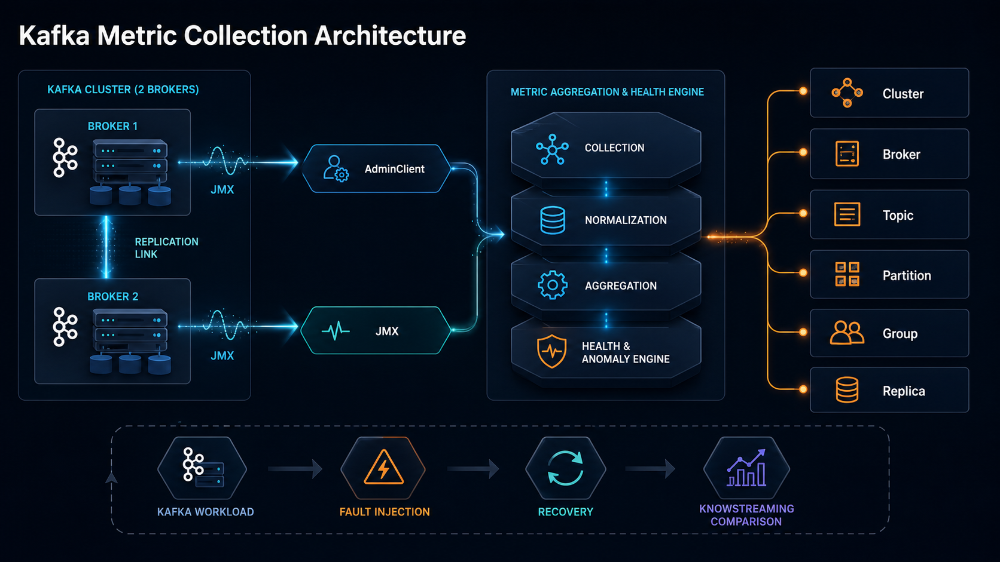
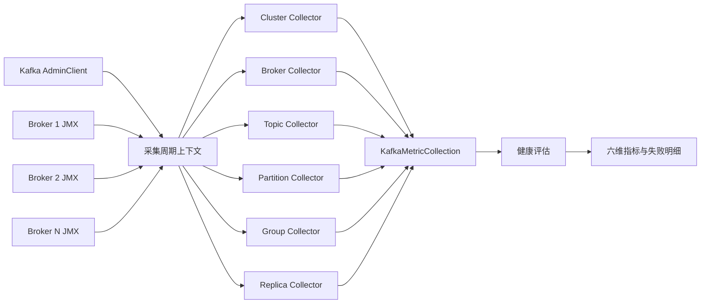
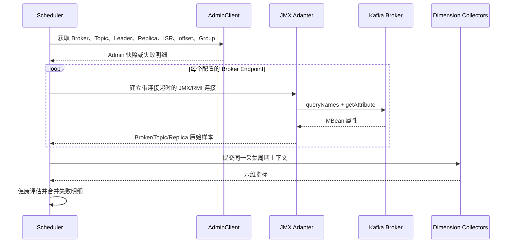
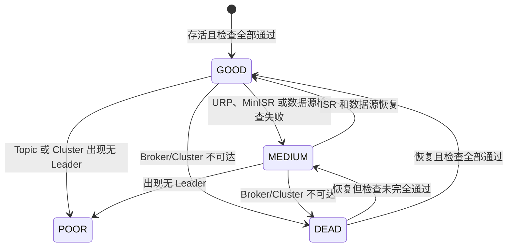

# Kafka 指标采集技术方案

本文给出 EventMesh Dashboard 的 Kafka 指标采集实现方案。设计基线是 Kafka 4.5.0-SNAPSHOT，指标口径与 KnowStreaming 保持兼容。结论先说：指标领域必须按 Cluster、Broker、Topic、Partition、Group、Replica 六个维度拆分；AdminClient 和 JMX 只是数据源，不能成为业务模块边界。

## 1. 设计边界

一次采集周期只做四件事：读取 AdminClient、读取各 Broker JMX、按六个维度生成指标、计算健康状态。采集结果允许部分成功；某个 Broker 的 JMX 不可达时，AdminClient 能确认的拓扑、存活和 ISR 信息仍应返回。

当前目录共定义 110 个指标，全部有唯一维度：

| 维度 | 数量 | 唯一标识 | 负责的类 | 主要职责 |
| --- | ---: | --- | --- | --- |
| Cluster | 43 | 集群 | `KafkaClusterMetricCollector` | 汇总 Broker、分区和 Group 指标，输出集群健康 |
| Broker | 31 | Broker ID | `KafkaBrokerMetricCollector` | Broker 吞吐、队列、连接、复制、容量、倾斜度和存活 |
| Topic | 18 | Topic | `KafkaTopicMetricCollector` | Topic 吞吐、失败请求、消息量、日志量和 URP |
| Partition | 6 | Topic + Partition | `KafkaPartitionMetricCollector` | offset、消息量、Leader 副本大小和估算流量 |
| Group | 7 | Group；明细附带 Topic + Partition | `KafkaGroupMetricCollector` | Group 状态、提交 offset 和消费延迟 |
| Replica | 5 | Broker + Topic + Partition | `KafkaReplicaMetricCollector` | 本地副本 offset、日志量、消息量和 ISR 状态 |

`KafkaMetricsCollector` 只负责编排，不持有具体指标公式。`KafkaAdminSource` 在每个采集周期内读取一次集群身份、Topic 拓扑、offset 和 Group 信息，并返回包含指标与元数据的 `KafkaAdminSnapshot`；`KafkaJmxMetricCollector` 把 MBean 属性转换为带维度的数值。两类源数据进入同一个不可变采集上下文，再交给六个维度 Collector。这样可以保证同一周期使用同一份 AdminClient 拓扑，并避免重复调用 `listTopics` 和 `describeTopics`。

代码按职责分为三部分：`gather/jmx` 提供与 Kafka 无关的 JMX 连接能力，`gather/kafka/metrics` 保存指标定义和采集结果模型，`gather/kafka/collector` 保存 Kafka 数据源、采集编排和维度计算。Collector 内部实现保持包内可见，对外只暴露总采集入口、JMX Endpoint 和结果模型。

## 2. 数据源怎么选

原则是“拓扑和 offset 用 AdminClient，本地运行态用 JMX，跨实体计算放在维度 Collector”。不要用 JMX 猜集群拓扑，也不要用 AdminClient 伪造 Broker 的瞬时速率。

| 数据类型 | 首选来源 | 原因 |
| --- | --- | --- |
| Broker 列表、Controller、Topic、Leader、Replica、ISR | AdminClient | 集群元数据权威，Broker JMX 断开后仍可读取 |
| Partition earliest/latest offset | AdminClient | 面向 Leader 的统一视图，可直接计算保留消息量 |
| Group 状态、提交 offset、Lag | AdminClient | JMX 不提供完整的 Group + Topic + Partition 视图 |
| Broker 队列、连接、空闲率、吞吐、复制流量 | JMX | Broker 本地实时运行态 |
| Topic 请求率和吞吐 | JMX | 来自带 Topic 标签的 BrokerTopicMetrics |
| Replica 本地 offset 和日志大小 | JMX | 同一分区在不同 Broker 上可能不同 |
| 健康、倾斜度、聚合值 | 派生 | 需要组合多个来源和多个实体 |

AdminClient 必须列出内部 Topic。否则 Broker 和 Cluster 的 `LogSize` 会漏掉 `__consumer_offsets` 等内部日志，无法与 Broker 本地磁盘量对齐。对外展示时可以过滤内部 Topic，但容量汇总不能过滤。

## 3. JMX 获取方式

每个 Broker 都需要独立的 `KafkaBrokerJmxEndpoint`，至少包含 Broker ID、JMX Host、Registry Port、连接超时和请求超时。多 Broker 不能假设共用一个 JMX 端口。

### 3.1 Broker 侧要求

Broker 必须同时满足以下条件：

- 开启远程 JMX，并固定 Registry Port；
- 固定 RMI Server Port，便于防火墙放行；
- 设置客户端可达的 RMI Hostname，不能把容器内部地址返回给宿主机客户端；
- 生产环境启用认证和 TLS，并把凭据交给密钥管理系统；
- 每个 Broker 的 Host + Port 组合必须可唯一定位该 Broker。

JMX/RMI 建连有两段：客户端先访问 Registry，再根据 Registry 返回的地址访问 RMI Server。只开放 Registry Port，或把 RMI Hostname 配成不可达地址，都会出现“端口能连但 JMX 仍超时”的情况。

### 3.2 客户端读取流程

连接超时和请求超时必须分开。`jmx.remote.x.request.waiting.timeout` 只限制连接建立后的请求，不能限制 RMI Registry 建连。本实现把 `connect()` 放入守护线程并使用 Future 超时；超时后立即返回，清理动作异步执行，避免 `close()` 再次阻塞调用线程。正常连接仍由 try-with-resources 同步关闭。

### 3.3 MBean 读取规则

JMX 适配器只做通用工作：按 ObjectName Pattern 查询 MBean、读取数值属性、提取 Broker/Topic/Partition 标签、合并同一实体的多个 MBean。指标定义负责声明 Pattern 和属性名。

| MBean 组 | 读取内容 |
| --- | --- |
| `BrokerTopicMetrics` | 消息、请求、BytesIn/Out、失败请求、复制和迁移流量 |
| `RequestChannel` | 请求队列和响应队列 |
| `SocketServer`、`socket-server-metrics` | 网络空闲率和连接数 |
| `KafkaRequestHandlerPool` | 请求处理线程空闲率 |
| `ReplicaManager` | Partition、Leader、URP、Under/At MinISR |
| `KafkaController` | Active Controller 标记 |
| `kafka.log:type=Log` | 副本起止 offset 和日志大小 |
| `kafka.cluster:type=Partition` | Topic 级 URP |

Meter 使用 `OneMinuteRate`、`FiveMinuteRate`、`FifteenMinuteRate`；Gauge 通常读取 `Value`。JMX 返回非数值属性时，不做字符串猜测，记录该指标失败。

## 4. 六个维度的计算口径

### 4.1 Cluster

Cluster Collector 复制 AdminClient 生成的无 Leader 分区数、Group 状态数和保留消息量，再汇总所有 Broker 的队列、连接、吞吐、URP、MinISR 和日志大小。`ActiveControllerCount` 的正常值应为 1。

四个 `LoadReBalance*` 属于 KnowStreaming 企业扩展，社区 Kafka 没有对应数据源。为保持接口兼容，本实现返回 0，并在指标目录中标记为 `ENTERPRISE_COMPATIBILITY`。

### 4.2 Broker

Broker 的速率、连接和队列取自 JMX。`Partitions` 和 `Leaders` 以 AdminClient 拓扑为准，即使该 Broker 已离线、JMX 不可达，也能得到正确数量：

- `Partitions`：该 Broker 出现在 Replica 列表中的分区数；
- `Leaders`：Leader 等于该 Broker 的分区数；
- `PartitionsSkew = (Broker Partitions - 平均 Partitions) / 平均 Partitions`；
- `LeadersSkew = (Broker Leaders - 平均 Leaders) / 平均 Leaders`；
- `LogSize`：该 Broker 上所有有效本地副本日志大小之和。

`EventQueueSize` 在 Kafka 4.5 KRaft 中没有旧版 Gauge。MBean 存在时读取真实值，不存在时返回兼容值 0，并标记为 `LEGACY_JMX_COMPATIBILITY`。

### 4.3 Topic

Topic 的消息量来自各 Partition 保留消息量之和；吞吐和失败请求按 Topic 标签跨 Broker 汇总；`LogSize` 汇总该 Topic 的全部副本，因此 RF=2 时通常接近 Leader 数据量的两倍。`PartitionURP` 汇总该 Topic 下未充分同步的分区。

Topic 级 `BytesIn` 受 Kafka BrokerTopicMetrics 的记账语义影响，不应强行要求它与 Broker 客户端 `BytesIn` 精确相等。稳定 Gauge 可以精确对照，滑动窗口 Rate 只能做方向和量级校验。

`MirrorFetchLag` 只存在于定制 Kafka，社区 Kafka 返回兼容值 0，并标记为 `CUSTOM_KAFKA_COMPATIBILITY`。

### 4.4 Partition

- `Messages = max(0, LogEndOffset - LogStartOffset)`；
- `LogSize` 取 Leader 所在 Broker 的本地副本大小；
- `BytesIn/Out` 沿用 KnowStreaming 口径：把同一 Broker、同一 Topic 的速率按该 Broker 上的 Leader 分区数均分。

Partition 流量是估算值，不是 Kafka 原生的分区级计数。若业务要求精确分区流量，需要在生产/消费链路增加埋点，不能继续从 Topic Rate 反推。

### 4.5 Group

Group Collector 输出 Group 状态，并对每个已提交分区计算：

- `OffsetConsumed`：Group 提交 offset；
- `LogEndOffset`：该分区最新 offset；
- `Lag = max(0, LogEndOffset - OffsetConsumed)`。

未提交 offset 的分区没有 Group Lag 样本，不能用 0 代替“未知”。

### 4.6 Replica

Replica 以 Broker + Topic + Partition 唯一标识。起止 offset 和日志大小取 Broker 本地 JMX；`Messages` 由本地起止 offset 相减；`InSync` 由 AdminClient ISR 集合判断。Broker 离线后，本地 JMX 指标缺失，但 `InSync=0` 仍能返回。

## 5. 健康和失败语义

健康状态使用四级编码：0 好、1 中、2 差、3 宕机。

缺失值不等于 0。JMX 不可达时，URP 或 MinISR 检查记为未通过，不能因为样本不存在就增加 `HealthCheckPassed`。Broker 的 `Alive` 由 AdminClient Broker 列表判断；Cluster 的 `Alive` 要求存在 Controller 且至少有一个 Broker。

采集采用部分失败模型：

- 单个 MBean 失败，只丢失对应指标并记录 Metric、ObjectName 和原因；
- 单个 Broker JMX 失败，其他 Broker 和 AdminClient 指标继续返回；
- AdminClient 元数据失败时，不生成依赖拓扑的派生值；
- 不为不可用的瞬时速率、容量和 offset 伪造 0；
- 只有明确的兼容指标可以返回兼容值 0。

## 6. Kafka 4.5 兼容性审计

110 个指标逐项纳入目录测试，并校验维度、来源和 JMX Descriptor。审计结果如下：

| 状态 | 数量 | 范围 |
| --- | ---: | --- |
| 标准支持 | 104 | Kafka 4.5 AdminClient、JMX、派生和健康指标 |
| 旧版 JMX 兼容 | 1 | Broker `EventQueueSize` |
| 定制 Kafka 兼容 | 1 | Topic `MirrorFetchLag` |
| 企业扩展兼容 | 4 | Cluster `LoadReBalance*` |

目录测试还保证：所有 JMX 指标都有 ObjectName/Attribute 描述；Partition offset 使用 AdminClient，而 Replica offset 使用本地 JMX；六个维度恰好各有一个领域 Collector。新增指标时，必须同时更新所属维度枚举、来源、兼容状态和场景验证，不能只增加字段名。

## 7. 真实环境验证

验证环境不是 Mock：Kafka 4.5.0-SNAPSHOT KRaft 集群包含两个 Broker，KnowStreaming 3.4.0、Elasticsearch 和 JMX 均为本机真实服务。

| 项目 | 配置 |
| --- | --- |
| Broker 1 | Kafka `localhost:9092`，JMX `192.168.3.234:9999` |
| Broker 2 | Kafka `localhost:9094`，JMX `127.0.0.1:9998` |
| 主验证 Topic | 6 Partition，RF=2，`min.insync.replicas=2`，初始 Leader 全在 Broker 1 |
| 倾斜 Topic | 4 Partition，RF=1，分配为 Broker 1 三个、Broker 2 一个 |
| 工作负载 | 100,000 条、每条 1024 字节、约 2,000 条/秒 |
| Consumer Group | 提交消费 10,000 条，初始总 Lag 90,000 |

验证覆盖正常、负载、故障和恢复四段：

| 场景 | 观察结果 |
| --- | --- |
| 持续写入 | Topic Messages=100,000；Group Lag=90,000；Broker 复制流量为正；采集失败数为 0 |
| Broker 2 停机 | 6 个 RF=2 分区 ISR 从 `{1,2}` 变为 `{1}`；Broker/Cluster/Topic URP=6；Broker 2 的 6 个 Replica `InSync=0` |
| MinISR 写入失败 | `acks=all` 写入返回 `NotEnoughReplicasException`；发送 0 条；UnderMinISR=6；Topic FailedProduceRequests 为正 |
| Broker 2 恢复 | 6 个分区 ISR 回到 `{1,2}`；两个 Broker Alive=1、URP=0、HealthState=0；6 个 Replica `InSync=1` |
| 恢复后写入 | 1,000 条 `acks=all` 全部成功；Broker 1 ReplicationBytesOut 和 Broker 2 ReplicationBytesIn 为正 |

故障采集周期在默认 AdminClient 15 秒上限内返回；离线 JMX 的 100 毫秒连接超时测试实际约 0.1 秒，不再被同步 `close()` 拖到 5 秒。

### 7.1 与 KnowStreaming 对照

恢复后的同一时段，本实现得到：Cluster ActiveControllerCount=1、PartitionURP=0、PartitionNoLeader=0、LeaderMessages=101,068、TotalLogSize=209,522,378；Broker 1 Partitions=60、Leaders=60、LogSize=104,765,977；Broker 2 Partitions=7、Leaders=1、LogSize=104,756,401。

KnowStreaming 的 Cluster `PartitionURP=0`、`PartitionNoLeader=0`、`LeaderMessages=101,068` 与本实现一致，`TotalLogSize=209,522,368` 的 10 字节差异来自采集时刻。Broker 1 的 Partitions、Leaders 和 LogSize 也一致。

本地环境同时暴露了 KnowStreaming 的部署限制：一个 Cluster 只能配置一个 JMX Port，而两个本地 Broker 共用同一 Host、JMX Port 不同。KnowStreaming 因而把 Broker 1 的 `9999` JMX 数据重复用于 Broker 2，错误显示 Broker 2 Partitions=60、Leaders=60，并把 Cluster ActiveControllerCount 汇总为 2。本实现按 Broker 配置独立 JMX Endpoint，得到 Broker 2 的真实值 7、1，并保持 ActiveControllerCount=1。生产部署应为每个 Broker 提供可唯一寻址的 Host + Port，或通过独立地址映射解决这一限制。

## 8. 上线检查清单

1. 为每个 Broker 配置唯一、可达的 JMX Endpoint，并验证 Registry 返回的 RMI Host/Port。
2. 设置连接超时、请求超时和 AdminClient 超时；调度周期必须大于最坏采集时长。
3. 开启 JMX 认证、TLS 和网络访问控制；凭据不得写入普通配置日志。
4. 确认 AdminClient 能列出内部 Topic，否则容量汇总会偏小。
5. 先核对稳定 Gauge：Broker 数、Partition、Leader、URP、LogSize、ActiveControllerCount。
6. 对 Rate 只比较趋势和量级，不要求跨系统同秒精确相等。
7. 做一次真实 Broker 停机和恢复演练，确认 URP、MinISR、Replica InSync 和健康状态均按预期变化并恢复。
8. 监控采集失败明细和耗时；部分成功不能被整体成功状态掩盖。
9. Kafka 升级时重新检查 MBean 是否存在、属性类型和 ObjectName 标签。
10. 对兼容值建立单独展示说明，避免把“不支持”解释为“业务值为 0”。

这套结构把变化隔离在正确位置：Kafka 版本差异留在数据源和指标目录，聚合公式留在维度 Collector，调度器只处理一次采集周期。新增来源不会改写六个领域边界，新增指标也能明确回答“属于哪个维度、从哪里来、缺失时代表什么”。
